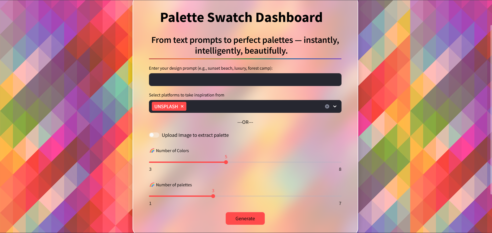
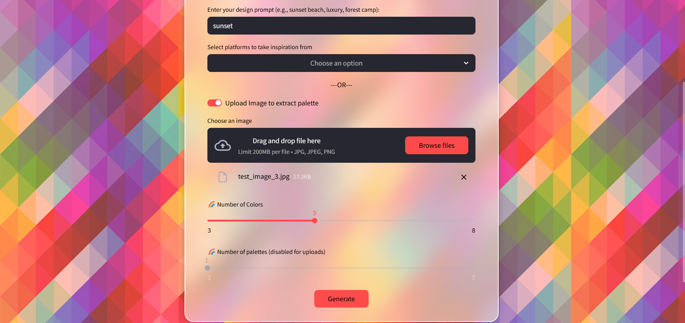
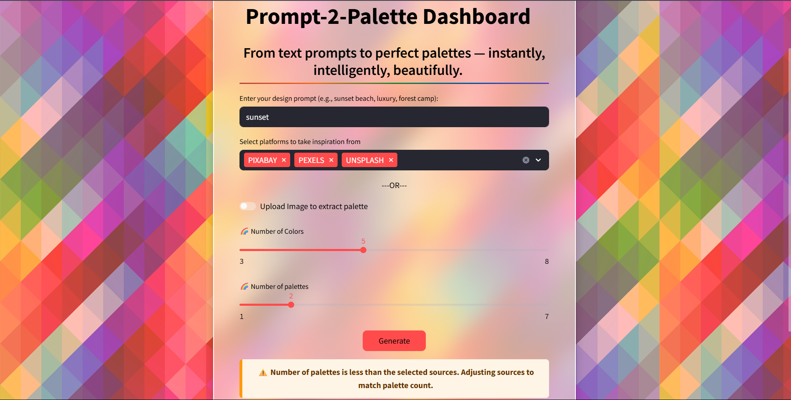
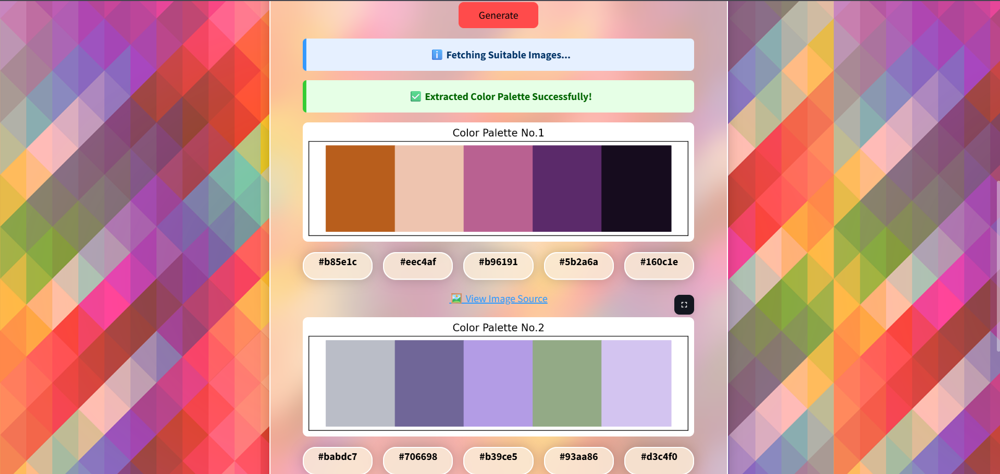
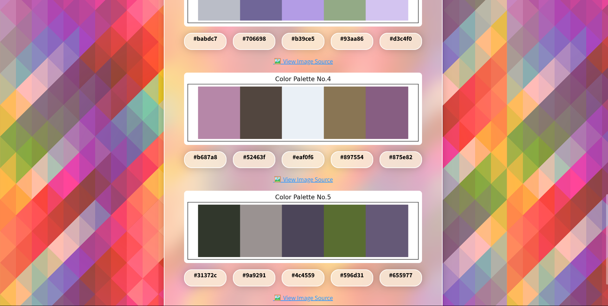
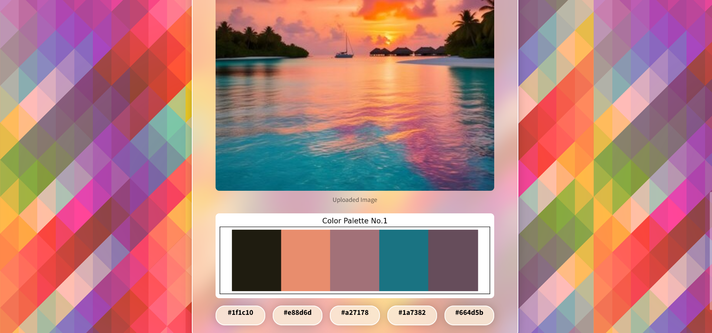

<h1 align="center">🎨 Prompt-2-Palette</h1>

 Prompt-2-Palette is an AI-powered tool that bridges the gap between your creative vision and the perfect color palette. Whether you’re a designer, developer, or branding professional, this app helps you translate simple text prompts or inspiring images into meaningful, emotionally resonant color palettes.

  

---

## 📌 Problem Statement

Despite countless online palettes, people struggle to choose colors that align with their mood, theme, or vision — especially non-designers. It’s not about lacking choices; it’s about lacking intelligent guidance. Prompt-2-Palette solves this by making color selection smart, intuitive, and context-aware.

---

## ✅ Key Features

- **Prompt-Based Palette Generation:** Enter a descriptive text prompt like *“Serene Spa”* or *“Dynamic Startup”*.
- **Image-Based Palette Generation:** Upload your own image to extract dominant colors.
- **Automatic Image Fetching:** Uses APIs (Unsplash, Pexels, Pixabay) to find images that match your prompt.
- **AI Color Extraction:** Uses K-Means clustering to find dominant colors and generates HEX codes.
- **Streamlit Dashboard:** Simple, interactive interface for fast, responsive use.
- **Input Validation:** Smart alerts for missing prompts, invalid formats, or empty sources.

---

## ⚙️ Tech Stack & Tools

| Category             | Details                                      |
|----------------------|----------------------------------------------|
| **Language**         | Python 3.8+                                  |
| **Framework**        | [Streamlit](https://streamlit.io/)           |
| **Machine Learning** | K-Means Clustering (`sklearn`)               |
| **Image Processing** | PIL (Pillow), NumPy                          |
| **APIs**             | Unsplash, Pexels, Pixabay                     |
| **Libraries**        | `sklearn`, `Pillow`, `NumPy`, `requests`, `matplotlib`, `streamlit` |

---

## 🧩 System Development Approach

1. **Data Collection:** Fetch images using APIs or accept user uploads.
2. **Preprocessing:** Clean image URLs, resize images, convert to RGB arrays.
3. **Algorithm:** Apply K-Means Clustering to extract dominant colors.
4. **Deployment:** Built and deployed using Streamlit for rapid prototyping.
5. **Evaluation:** Qualitatively assessed for color balance & aesthetics.

---

## 🔍 How It Works

1. **Describe your vision:** Enter a prompt describing your mood or theme.
2. **Provide inspiration:** Upload an image or let the app fetch relevant images.
3. **Extraction:** Images are analyzed to extract meaningful color clusters.
4. **Result:** View your unique, context-aware color palette with HEX codes.

---

## 🖼️ Example Output

- **Input Interface:** Prompt, source selection, palette count, and image upload.
  

- **Smart Validation:** Warnings and messages for missing or invalid input.
  

- **API-Fetched Palette:** Generated palettes from images fetched via APIs.
  
  

- **Uploaded Image Palette:** Palettes extracted from a user-uploaded image.
  

---

## 🚀 Future Scope

- Integrate color psychology to better match emotional context.
- Tag colors (e.g., background, accent, text).
- Export palettes in CSS, PNG, JSON.
- Use advanced AI models like CLIP or Stable Diffusion for direct prompt embeddings.
- Apply color harmony rules (analogous, triadic, complementary).

---

## 🔗 Related LinkedIn Post

> ✨ A small ML idea, a big learning curve — and an even bigger story worth sharing
> Read the full story behind building **Prompt-2_Palette** on LinkedIn:  
**[🔗 Click to read](https://www.linkedin.com/posts/diyumana-bhardwaj_firstmlproject-prompttopalette-cutecodemoments-activity-7346580940669820928-zblV?utm_source=share&utm_medium=member_desktop&rcm=ACoAAESuVMMBVZc_3wpWPqClK3GIK4xugcX6uHU)**
**Developed with ❤️ by Diyumana Bhardwaj**
